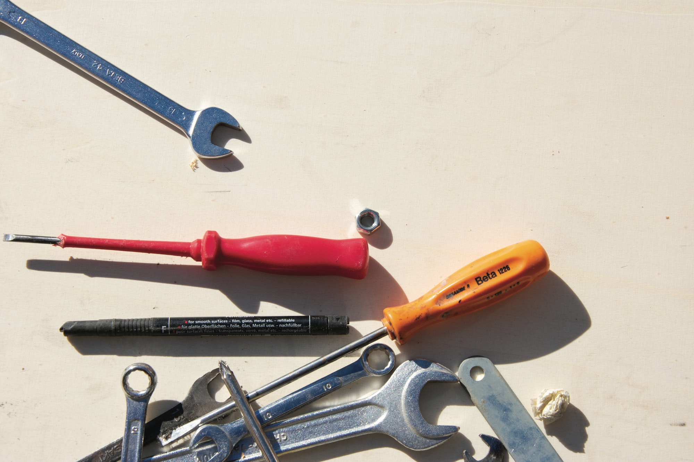
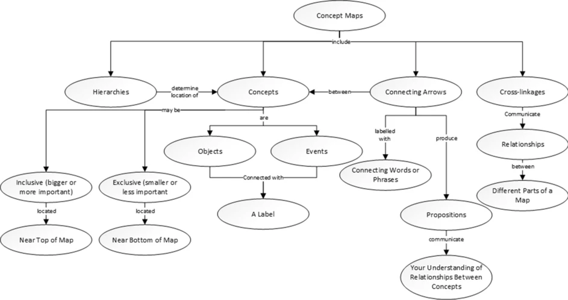
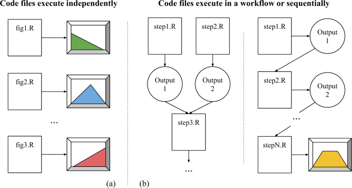
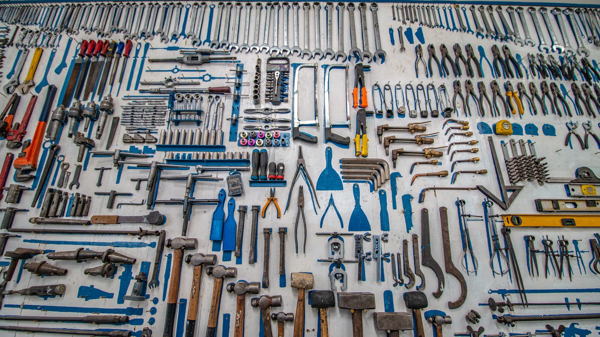

```{r setup, include=FALSE}
knitr::opts_chunk$set(echo = TRUE)
```



## Overall Workshop Learning Objectives

-   Learn how to incorporate R into your research workflow
-   Become familiar with RStudio Workbench and R
-   Build community with colleagues also learning R
-   Develop code for a specific research process

## Concept Maps and the Research Process

Taken from [De Reis, 2021](https://link.springer.com/article/10.1007/s11135-021-01113-x):

Concept maps were introduced by Novak and Gowin to activate or elaborate (prior) knowledge. "Concept maps are graphical tools for organizing and representing knowledge. They include concepts, usually enclosed in circles or boxes of some type, and relationships between concepts indicated by a connecting line linking two concepts" (Novak and Cañas 2008).



Developing a concept map for your research project is a helpful organization exercise that can surface

-   specific data needs - where is your data? what needs to happen to your data before you can analyze it?
-   software/hardware dependencies - what software do you need to acquire / analyze the data? Are there special visualization workflows that are essential to your process?
-   barriers / bottle necks - Where do things break down? How do you manage collaborative projects? Where would you like to see better efficiencies?
-   big and small questions - What are the research questions that your project addresses? These can be both broad but also specific questions.

## How scripting languages like R can help research workflows

The use of R in creating reproducible workflows is well documented. A recent article ([Crosas](https://www.nature.com/articles/s41597-022-01143-6#auth-Merc_-Crosas), 2022) explores the way R can and cannot improve reproductibility but there are more than reproducible benefit from using a scripting language in your research workflows. Scripting can:

-   Automate data scrapping / input steps

-   Automate data cleaning / wrangling / formatting

-   Automate statistical analysis

-   Enable quick exportatory data analysis

-   Automate the creation of 'rough' data visualizations

-   Enable the creation of publication ready data visualizations

-   Enable publishing and documentation efficiencies using tools like [Markdown](https://rmarkdown.rstudio.com/index.html) and Quattro



## Carpentry Approach to Data Analysis and Visualization

This workshop is built on the [carpentry approach](https://carpentries.org/about/) to teaching data and coding skills. There are three subsections of the Carpentries but they are all organized all the central notion of building a toolbox of knowledge and skills in data and coding.

One of my hopes for this workshop is for you to think about what is currently in your toolbox and what tools you'd like to add.



## Schedule of the Workshop

| Time          | Topic                                   |
|---------------|-----------------------------------------|
| 10:00 - 10:30 | Introduction, Concept Maps, and Outline |
| 10:30 - 11:15 | RStudio Workbench Setup / R Basics      |
| 11:15 - 11:20 | Break                                   |
| 11:20 - 12:00 | Introduction to ggplot                  |
| 12:00 - 12:30 | Lunch                                   |
| 12:30 - 01:25 | Data Transformations                    |
| 01:25 - 01:30 | Break                                   |
| 01:30 - 02:25 | Data Wrangling                          |
| 02:25 - 02:30 | Break                                   |
| 02:30 - 03:00 | Stats and Implementing your Own Code    |
