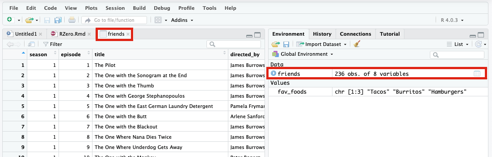

```{r setup, include=FALSE}
knitr::opts_chunk$set(echo = TRUE)
```

## *Learning Objectives*

-   Become familiar with the RStudio environment

-   Identify the key elements of the R programming language

    -   Functions
    -   Packages
    -   Objects
    -   Operators
    -   Vectors
    -   Data frames

-   Write your first R code

## The RStudio Environment

Load [RStudio Workbench](http://spiderweb.richmond.edu:8787) in your favorite browser, open the Transition to R project, and you should see a window similar to that shown below.

<center>

{#id .class width="50%" height="50%"}

</center>

The following windows will appear as part of the RStudio user-interface:

-   **Console window** - The window on the right in Figure 1 is the standard R console window (the only one you would see if you used only R and not R via RStudio. This is the window where you type in commands and the results are returned.

-   **Workspace / History** - This window (left side in Figure 1) shows all the objects that you have created in the current R session (Workspace tab) and the commands you have used in the current R session (History tab).

-   **Files / Plots / Packages / Help** - This window (bottom right in Figure 1) is primarily used for displaying plots (graphs) and for using the help system.

**R** is a command driven program, which means that you type in code to the Console window and it returns the result. The advantage of this is that the software is very powerful, but the disadvantage is that to start with the software requires a steep learning curve!

You can either type code directly into the Console window, or you can type it into a text file, and then run the code you have written in the Console window. The advantage of the latter is that you can save the code, so that to run it a second time at a later date, simply open the text file and run the code, you do not need to type it in a second time! To create a text file to write your code in select

**File -\> New File -\> R Script**

and the RStudio window changes to:

<center>

{.class width="50%" height="50%"}

</center>

To save the R code (once you've written some!), go to

**File -\> Save**

and a dialog box will appear asking where (on which drive) you would like to save the code. Once saved, you can use your code again, so no need to type it in a second time. If you close RStudio and then open it again you can read in your code by going to

**File -\> Open File...**

or navigate to your file in the "Files/Plots/Pkgs/Help" window (see image below) and find the file from the location where you saved it.

<center>

{.class width="50%" height="50%"}

</center>

For a comprehensive one-page guide to the RStudio IDE, check out this ['cheatsheet'](https://github.com/rstudio/cheatsheets/raw/master/rstudio-ide.pdf)

## Key Elements of R Programming Language

Now let's start to explore what R can do for us.

### **Functions**

A function in R (or any computing language) is a short program that takes some input and returns some output. Functions may seem like an advanced topic (and they are), but you probably have already used many functions if you've used Microsoft Excel (think sum() or mean() - both of which are tiny programs that running specific actions on data).

\#\#\#\#**Exercise 1**

Try the following functions by writing them in your script. See if you can guess what they do, and make sure to add comments to your script about your assumed purpose.

```{r}
dir()
```

```{r}
sessionInfo()
```

```{r}
date()
```

```{r}
Sys.time()
```

\#\#\#\#**Exercise 1 solutions**

`dir()` \# Lists files in the working directory `sessionInfo()` \# Gives the version of R and additional info including on attached packages `date()` \# Gives the current date `Sys.time()` \# Gives the current time

#### **An R Function has three key properties:**

-   Functions have a name (e.g. `dir`); note that functions are case sensitive
-   Function names are followed by a pair of `()`
-   Inside the parentheses, a function may take 0 or more **arguments**

An **argument** may be a specific input for your function and/or may modify the function's behavior. For example the function `round()` will round a number with a decimal:

```{r}
# This will round a number to the nearest integer
round(3.14159)
```

#### Getting help with function arguments

**?**

What if you wanted to round to one significant digit? `round()` can do this, but you may first need to read the help to find out how. To see the help (In R sometimes also called a "vignette") enter a `?` in front of the function name:

```{r}
?round()
```

The "Help" tab will show you information (often, too much information). You will slowly learn how to read and make sense of help files. Checking the "Usage" or "Examples" headings is often a good place to look first. If you look under "Arguments," we also see what arguments we can pass to this function to modify its behavior.

**args**

You can also see a function's argument using the `args()` function:

```{r}
args(round)

#add code below to round 3.14159 to 3.14
round(3.14159, digits = 2)
```

**Contentual Help**

Here is one last bonus we will mention about RStudio. It's difficult to remember all of the arguments and definitions associated with a given function. When you start typing the name of a function and hit the `Tab` key, RStudio will display functions and associated help:

<center>

{.class width="75%" height="75%"}

</center>

Once you type a function, hitting the `Tab` inside the parentheses will show you the function's arguments and provide additional help for each of these arguments.

<center>

{.class width="75%" height="75%"}

</center>

*derived in part from <https://datacarpentry.org/genomics-r-intro/01-introduction/index.html>*

### **Packages**

Built into R is a wide range of functions that'll assist you in analyzing and visualizing your data. However, the true power of R comes from the millions of additional functions you can load into your coding environment. There is an enormous development community that is continually updating and creating new packages that enhance the functionality of R.

To install packages use the `install.package()` function and to load a package into your current environment use the `library()` function. For each of these functions, pass the name of the package inside quotations marks (e.g. `install.packages("cowsay")` and `library("cowsay")`

```{r}
#type in the the code to install and load the cowsay package below


```

### **Objects**

What might be called a variable in many languages is called an object in R.

To create an object you need:

-   a name (e.g. 'a')
-   a value (e.g. '1')
-   the assignment operator ('\<-')

Nifty keyboard shortcut alert! To make a \<- : hold `Alt` (or `option` on a Mac) and press the `-` (minus sign) key.

```{r}
# this line creates the object 'a' and assigns it the value '1'

a <- 1
```

Next, run this line of code in your script. You can run a line of code by hitting the Run button that is just above the first line of your script in the header of the Source pane or you can use the appropriate shortcut:

-   Windows execution shortcut: `Ctrl`+`Enter`
-   Mac execution shortcut: `Cmd(⌘)`+`Enter`

To run multiple lines of code, you can highlight all the line you wish to run and then hit Run or use the shortcut key combo listed above.

```{r}
#####Create the following objects; give each object an appropriate name (your best guess at what name to use is fine):

#Create an object that has the value of number of pairs of human chromosomes


#Create an object that has a value of your favorite gene name


#Create an object that has this URL as its value: “ftp://ftp.ensemblgenomes.org/pub/bacteria/release-39/fasta/bacteria_5_collection/escherichia_coli_b_str_rel606/”

#Create an object that has the value of your birthday


```

\#\#\#\#\*Reassigning object names or deleting objects

Once an object has a value, you can change that value by overwriting it. R will not give you a warning or error if you overwriting an object, which may or may not be a good thing depending on how you look at it.

```{r}
a <- 4
```

You can also remove an object from R's memory entirely. The `rm()` function will delete the object.

```{r}
# delete the object 'gene_name'
rm(gene_name)
```

### **Operators**

Once an object exists (which by definition also means it has a mode), R can appropriately manipulate that object. For example, objects of the numeric modes can be added, multiplied, divided, etc. R provides several mathematical (arithmetic) operators including:

| Operator   | Description                                     |
|------------|-------------------------------------------------|
| \+         | Addition                                        |
| \-         | Subtraction                                     |
| \*         | Multiplication                                  |
| /          | Division                                        |
| \^ or \*\* | Exponentiation                                  |
| a%?%b      | Integer Division (where remainder is discarded) |
| a%%b       | modulus (returns remainder after division)      |

These can be used with literal numbers:

```{r}
(1+ (5**0.05))/2
```

and importantly, can also be used on any object that evaluates to (i.e. interpreted by R) a numeric object:

```{r}
number_of_presidents <- 45

as_of_jan202021_number_of_presidents <- number_of_presidents + 1

as_of_jan202021_number_of_presidents
```

### **Vectors**

Vectors are probably the most used commonly used object type in R. *A vector is a collection of values that are all of the same type (numbers, characters, etc.)*.

One of the most common ways to create a vector is to use the `c()` function - the "concatenate" or "combine" function. Inside the function you may enter one or more values; for multiple values, separate each value with a comma:

```{r}
## Create a list of your favorite foods
fav_foods <- c("Tacos","Burritos","Hamburgers")

## Check the mode, length, and structure of 'fav_foods'

# Mode
mode(fav_foods)

# Length
length(fav_foods)

# Structure
str(fav_foods)
```

### **Data frame**

A data frame is the standard way in R to store tabular data. A data fame could also be thought of as a collection of vectors, all of which have the same length.

**Importing tablular data into R**

There are several ways to import data into R. For our purpose here, we will focus on using the tools every R installation comes with (so called "base" R) to import a comma-delimited file containing the results of our variant calling workflow. We will need to load the sheet using a function called read.csv().

```{r Exercise: Review the arguments in the read.csv function}
# Before using the read.csv() function, use R’s help feature to answer the following questions.

#Hint: Entering ‘?’ before the function name and then running that line will bring up the help documentation. Also, when reading this particular help be careful to pay attention to the ‘read.csv’ expression under the ‘Usage’ heading. Other answers will be in the ‘Arguments’ heading.

#A) What is the default parameter for ‘header’ in the read.csv() function?

#B) What argument would you have to change to read a file that was delimited by semicolons (;) rather than commas?

#C) What argument would you have to change to read file in which numbers used commas for decimal separation (i.e. 1,00)?

#D) What argument would you have to change to read in only the first 10,000 rows of a very large file?
```

Now, let's read the file `friends_info.csv` which is located in `/Cloud/project/Data/`. Assign this data frame to an objected called `friends`. The first argument to ass to our `read.csv()` function is the file path for our data. The file path must be in quotes and now is a good time to remember to use tab autocompletion. **If you use tab autocompletion you avoid typos and errors in file paths. Use it!**

```{r}
## read in a CSV file and save it as 'friends'

friends <- read.csv("/cloud/project/Data/friends_info.csv")
```

One of the first things you should notice is that in the Environment window, you have the newly created `friends` object. listed with 236 obs. (observations/rows) of 29 variables (columns). Double-clicking on the name of the object will open a view of the data in a new tab.

<center>

{.class width="75%" height="75%"}

</center>

**Summarizing and determining the structure of a data frame.**

Using only two functions, we can learn a lot about a data frame including some summary statistics as well as well as the "structure" of the data frame. Let's examine what each of these functions can tell us:

```{r}
## get summary statistics on a data frame

summary(friends)
```

Our data frame had 8 variables, so we get 8 fields that summarize data. The `imdb_rating`, `us_views_millions`, `episode`, and `season` variables are numerical data and so you get summary statistics on the min/max values, as well as mean, median, and interquartile ranges. Variables like `air_date` and `title` are treated as categorical data.

Before we analyze the data further, we also need to know a little more about the data frame structure to do that we use the `str()` function:

```{r}
## get the structure of a data frame

str(friends)
```

Ok, that's a lot up unpack! Some things to notice.

-   the object type data.frame is displayed in the first row along with its dimensions, in this case 236 observations (rows) and 8 variables (columns)
-   Each variable (column) has a name (e.g. title). This is followed by the object mode (e.g. factor, int, num, etc.). Notice that before each variable name there is a \$ - this will be important later.

**Exercise: Import explore new data set**

```{r Exercise: Import and explore friends_emotions.csv}
## Import the friends_emotions.csv found in the cloud/project/Data folder and assign the data frame to a new object "emotions"

## Explore the structure of emotions. How many variables and observations does your data frame have? What mode are your variables?

## Run summary statistics on your data frame? Is there anything interesting from this summary?

```

## Your first code with COWSAY

For your next grant, you'd really like to include a figure what has a cow asking (politely) for a strong score. Let's figure out how to do that!

You are in luck, someone kind soul in this world created a package called "cowsay" that draws animals with dialogs boxes that you can populate!

1.  In your first two lines of code, install and load the cowsay package

2.  In line 4 of your code, use one of the help methods we learned to ascertain more about the cowsay package.

3.  Now that we know the cowsay package contains a single function, say(), determine what arguments you can pass to the function.

4.  In line 5 of your code, called the say() function and pass it the phrase/string "Me need \$"

5.  In line 6 of your code, let's create an object that contains your phrase

6.  In line 7 of your code, pass your object to the say().

7.  Cats are great but we really want a different animal to convey our feelings. Determine what argument you need to call to change your animal.

8.  Red text might be a little aggressive for your grant, determine what argument you need to call to change the color of your phrase. While you are at it, color the color of the animal as well.

9.  Some packages have built in data. In COWSAY, there is a "rms" data set that pulls a random 'quote 'fact' about Richard Stallman from rmsfact::rmsfact() package. Instead of having your animal say your phrase, have it say a random quote from Richard.

```{r}

```
