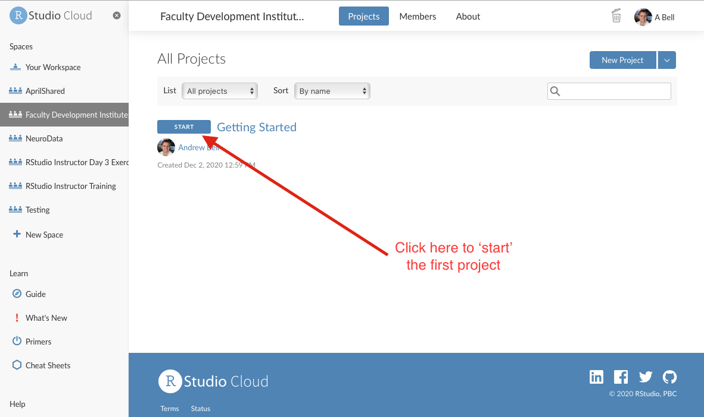
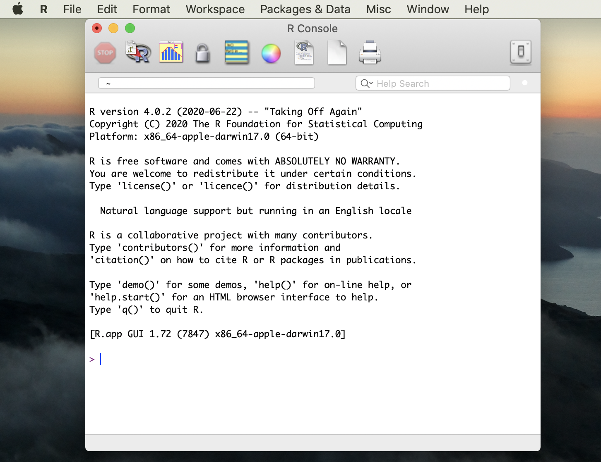

```{r setup, include=FALSE}
knitr::opts_chunk$set(echo = TRUE)
```

### *Learning Objectives*

-   Identify the different ways you can use R
-   Become familiar with RStudio Workbench: sessions vs projects
-   Identify the resources used to create this workshop that will help you in your journey to learn R.
-   If interested, learn how to install R and RStudio on your computer

### Ways to use R

R is a programming language, but also a software environment (R Core Team, 2020). To start learning R, you first need to install some software programs (R and RStudio) on your computer or use a hosted R development platform that already has R and RStudio installed (RStudio.Cloud). For this class, we will use RStudio.Cloud because it reduces the challenges of local, individual installations of R and RStudio.

We will talk about the advantage and disadvantages of using RStudio.Cloud later in this workshop but know that the University is currently supporting and paying for RStudio.Cloud for faculty teaching R. To request access, contact Fred Hagemeister in IS.

### RStudio.Cloud and R Projects

Navigate to [RStudio.Cloud](RStudio.Cloud) and sign in with your University of Richmond email address. To learn more about how to use RStudio.Cloud check out the official RStudio.Cloud guide [here](https://rstudio.cloud/learn/guide).

RStudio.Cloud is organized around two 'buckets': a workspace bucket (think entire course) and a project bucket (think specific lesson/class within the course). As participants in this workshop, you are already enrolled in my *Faculty Development Institute: Data Visualization with R* workspace in RStudio.Cloud.

Once you have successfully entered our workspace (*Faculty Development Institute: Data Viz with R*), notice that you have a number of projects available to you. We will start in the **"Getting Started"** project. Click Start (see image below) next to the Getting Started project to load the project.

<center>

{#id .class width="50%" height="50%"}

</center>

### Resources

This workshop relies heavily on two primary sources.

-   *R for Data Science* by Hadley Wickham and Garrett Frolemund which can be found at <https://r4ds.had.co.nz> (for free!)
-   *Data Visualization: A Practical Introduction* by Kieran Healy which can be found at <https://socviz.co> (also for free! - see Menu button on top left)

In addition to those books, if you are completely new to programming or simply want a good resource for learning R, I also highly recommend Garrett Frolemund's book *Hands-On Programming with R* [found here via the UR library](https://learning.oreilly.com/library/view/hands-on-programming-with/9781449359089/)

You might also find the cheatsheet's that RStudio provides to super helpful as you start to create your visualizations [found here](https://rstudio.cloud/learn/cheat-sheets)

### Optional:

**Downloading and Installing R**

1.  Go to <https://cloud.r-project.org/>
2.  Click on the link for the download you want, depending on whether you have a Mac or a PC that runs Windows.
3.  If you have never installed R before, click the base link. If you have... you probably know better than I do what you should do. On Windows the link is right at the top of the page, but if you're on a Mac you might have to scroll down a bit.
4.  Download the version of R you want (when in doubt, go with the latest version- at the time of this publication it is version 4.1.1).
5.  If you have Windows, you'll be asked a bunch of questions about things like where you want the file to be located, the components to be installed, the startup options... just go with the defaults. Mac users won't have to worry about it (you'll just need to move the file from your Downloads folder into Applications).
6.  Open up the file and check it out! If all is well, you should see something like this (image below):

<center>

{.class width="50%" height="50%"}

</center>

This is R's graphical user interface, but don't worry about it because you'll typically only use another tool for coding in R: RStudio.

**Downloading and Installing RStudio** RStudio is the integrated development environment (or IDE) that we'll be using to write R code. While an IDE is not necessary for coding, it's nice because you'll generally have some built-in tools that will help you along the way. They contain a text editor, debugging tools, and other neat stuff.

1.  Go to the RStudio website.

    -   Note: Some of you, especially if you've worked with Python at all, might have Anaconda installed and have seen that you can install R and RStudio there. I don't recommend it... mostly because I couldn't get it to work. I'm going to stick to the instructions from now on.

2.  Choose the version you want (might I suggest going with one of the FREE versions?). I went with the desktop version, but there's a server version as well.

3.  Hit that blue download button!

4.  The website will recommend a download for your system. That's the one you should probably just go with, but I would just double check that your system meets the requirements.

5.  There might be some set-up to do.

    -   If you're using Windows:
    -   You should see another Setup wizard. Hit "next."
    -   Like with R you'll have to select destination and start menu folders for RStudio. Put it wherever, but I'd recommend putting it in the same location as R so that RStudio will be able to easily "find" R on your machine. If you just go with the defaults you should be good.

6.  Once RStudio is finished installing, find it and open it- you'll need it to install some packages.
